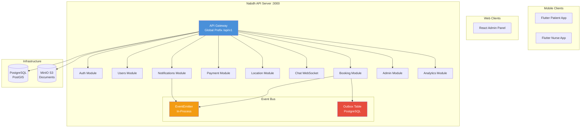

# Nabdh Architecture

## Overview

Nabdh is a modular monolith backend serving a real-time home nursing marketplace for Egypt. A single NestJS application hosts all domain logic, with strict module boundaries.

## Architecture Diagram

## Key Decisions

- **Single process** — all REST + WebSocket on port 3000
- **No Redis** — event-emitter + outbox table for async
- **PostGIS** — location proximity queries
- **MinIO** — S3-compatible document storage

## Module Communication

| Pattern | Mechanism | Use Case |
|---------|-----------|----------|
| Synchronous | Injected service | Cross-module queries (e.g., booking reads user) |
| In-process event | `@nestjs/event-emitter` | Immediate reactions (e.g., notification on offer) |
| Async event | Outbox table + cron | Reliable dispatch (e.g., analytics aggregation) |
